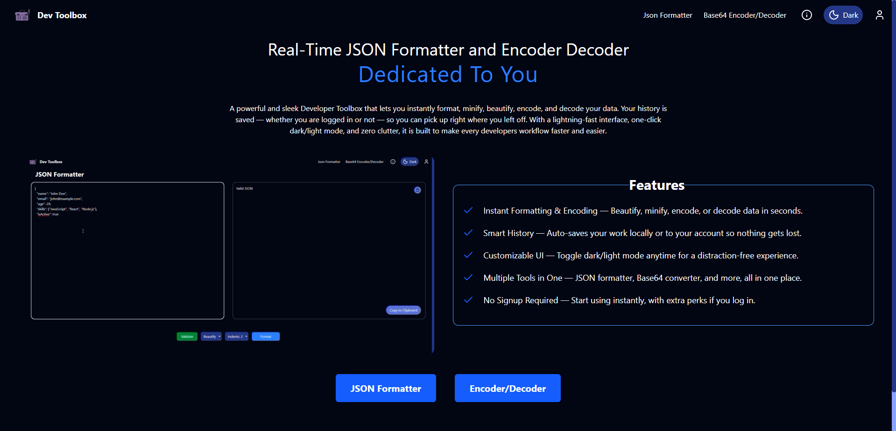

<div align="center">


# 🧰 Dev-ToolBox – Your All-in-One Developer Toolkit

> 🚀 A modern, full-stack platform offering a powerful suite of tools to simplify and supercharge your development workflow.

[](https://reactjs.org/)
[](https://vitejs.dev/)
[](https://nodejs.org/)

[](https://github.com/SubhodeepSamanta/Dev-ToolBox/stargazers)
[](https://github.com/SubhodeepSamanta/Dev-ToolBox/network/members)
[](https://github.com/SubhodeepSamanta/Dev-ToolBox/issues)

---

</div>

## ✨ Features

- ⚡ **Instant Formatting & Encoding** — Beautify, minify, encode, or decode data in seconds.
- 💾 **Smart History** — Auto-saves your work locally or to your account so nothing gets lost.
- 🎨 **Customizable UI** — Toggle dark/light mode anytime for a distraction-free experience.
- 🧩 **Multiple Tools in One** — JSON formatter, Base64 converter, and more, all in one place.
- 🚀 **No Signup Required** — Start using instantly, with extra perks if you log in.

---

## 🚀 Quick Start

### Prerequisites

- Node.js (v18+)
- npm (v9+)
- MongoDB 
- Git
- Zustand
- Tailwind CSS

### 1. Clone the Repository

```bash
git clone https://github.com/SubhodeepSamanta/Dev-ToolBox.git
cd Dev-ToolBox
```

### 2. Install Dependencies

```bash
cd Frontend
npm install
```

### 3. Frontend Setup

```bash
cd ../Frontend
npm install

# Create .env file and add:
VITE_API_ENDPOINT=http://localhost:5000
```

### 4. Run the App

```bash
# Backend
cd Backend
npm run dev

# Frontend (new terminal)
cd ../Frontend
npm run dev
```

## 📁 Environment Variables

### Backend

| Variable            | Description                 | Example                        |
|---------------------|-----------------------------|--------------------------------|
| `PORT`              | Server port                 | 5000                           |
| `MONGO_URI`         | MongoDB connection string   | mongodb+srv://...              |
| `JWT_SECRET`        | JWT secret key              | your-secret-key                |
| `CLIENT_URL`        | Frontend URL                | http://localhost:5173          |

### Frontend

| Variable            | Description                 | Example                        |
|---------------------|-----------------------------|--------------------------------|
| `VITE_API_ENDPOINT` | Backend API endpoint        | http://localhost:5600          |

---

## 🛠️ Tech Stack

### Frontend
- React + Vite
- Zustand
- Tailwind CSS
- React-Router
- Axios
- JavaScript (ES6+)

### Backend 
- Node.js
- Express.js
- MongoDB
- Mongoose
- JWT
- Bcrypt

---

## 🖼️ Screenshots

<div align="center">

| Toolbox Home | Tool Example | Settings |
|--------------|-------------|----------|
|  |  |  |

</div>

---

## 💻 Development Scripts

| Command        | Description                        |
|----------------|------------------------------------|
| `npm run dev`  | Starts frontend/backend in dev mode |

---

## 🤝 Contributing

We welcome contributions!

1. Fork this repo
2. Create your feature branch (`git checkout -b feature/AmazingFeature`)
3. Commit your changes (`git commit -m 'Add some feature'`)
4. Push to the branch (`git push origin feature/AmazingFeature`)
5. Open a Pull Request

---

## 📝 License

This project is licensed under the MIT License. See the [LICENSE](LICENSE) file for details.

---

<div align="center">

Made with ❤️ by [SubhodeepSamanta](https://github.com/SubhodeepSamanta)

</div>
